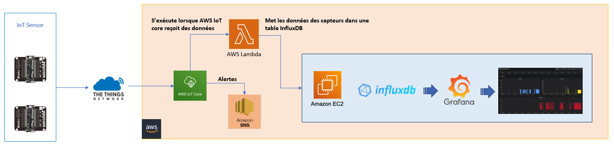

# IoT - Projet Ruches : Documentation

*Dylan Canton & Salim Grayaa*

*09.01.2023*

---

 Lien du repos Github : https://github.com/Cantondy/MA_IoT-Ruches


[TOC]

## 1. Description du projet

Le but de ce projet est d'effectuer de la surveillance de ruches à l'aide de capteurs IoT.

Des capteurs permettant de récolter des données sur l'humidité, la luminosité ainsi que la température sont installés dans des ruches. Ces derniers communiquent par la technologie LoRa avec un réseau TTN (The Thing Network) qui permettra ensuite d'envoyer et de stocker les données avec le cloud en utilisant la solution d'AWS (IoT Core).

Une fois les données sur le cloud, ces dernières sont envoyées à une base de donnée InfluxDB à l'aide d'une fonction Lambda. Les données peuvent ensuite être visualisées sur un dashboard Grafana. Des alertes (mail) sont également émises par AWS IoT core en cas de valeurs anormales. 

L'architecture mis en place doit être capable de supporter la gestion de plusieurs ruches ainsi que de plusieurs capteurs. Il est possible de gérer plusieurs "clients" différents grâce à l'utilisation d'IndluxDB qui permet de créer une table par utilisateur. 

La gestion multi-utilisateur est également possible en créant plusieurs utilisateurs rattachés à une même table ainsi que plusieurs utilisateurs pour un même dashboard dans Grafana. La gestion de plusieurs capteurs est également possible dans Grafana en visualisant les données de chaque capteur séparément.

Pour finir, un boolean envoyé depuis AWS IoT core permet de simuler l'ouverture ou la fermeture de la trappe d'une ruche à distance.

La solution présentée ci-dessous est donc pleinement fonctionnelle et scalable.


## 2. Architecture

Le schéma ci-dessous illustre l'architecture mise en place :




### 2.1 Capteurs

Les capteurs utilisés sont des *Pycom Lopy* montés sur une carte *Pycom Pysens*.


Ces capteurs possèdent des senseurs pouvant récupérer différentes valeurs comme l'humidité, la luminosité  et la température.

La programmation de ces capteurs s'effectuent avec l'IDE *Visual Studio Code* ainsi que le plugin *PyMakr* permettant de se connecter au capteur, le programmer et le tester.

Les données que l'on récupère ici sont donc :

* La luminosité (en lux)

* L'humidité (en pourcentage dans l'air)

* La température (en degrés Celsius)

  

Ces données sont récupérées à l'aide du code suivant :

```python
# Get temperature and humidity
si = SI7006A20(py)
temperature = si.temperature()
humidity = si.humidity()

# Get light
lt = LTR329ALS01(py)
lux = lt.lux()
```


### 2.2 The thing Network


### 2.3 AWS IoT Core


### 2.4 Influx DB

Afin d'afficher les données dans un dashboard comme *Grafana*, une base de données de type *Time Series Database* est nécessaire. Ce type de base de données permet en effet de stocker des données dans le temps en les associant à un timestamp. Ce type de base de donnée est très utilisé dans le domaine de l'IoT et des capteurs, puisque qu'il y a une volonté de voir l'évolution de valeurs dans le temps et d'effectuer une surveillance.

Une instance EC2 (avec un linux Ubuntu server) est donc créée, cette dernière héberge la base de donnée *InfluxDB* ainsi que *Grafana*. Les données reçues de la part des capteurs dans *AWS IoT Core* doivent donc être insérées dans une base de donnée *InfluxDB*, pour qu'elles puissent être ensuite récupérées par *Grafana* pour l'affichage. 

Une fois *InfluxDB* installée sur l'instance EC2, c'est une fonction lambda qui est utilisée pour insérer les données reçues par *AWS IoT Core* dans *InfluxDB*. 

* Il faut tout d'abord créer une règle dans *AWS IoT Core* pour indiquer que lorsque des données sont reçues des capteurs, ces dernières sont transmises à une fonction lambda. L'image ci-dessous montre l'instruction SQL de la règle qui récupère les données des capteurs (ID du capteur, luminosité, humidité, température et timestamp) ainsi qu'en dessous l'action désirée, à savoir ici envoyer ces données vers une fonction lambda définie.

  

* Nous pouvons ensuite créer la fonction lambda, cette fonction va envoyer les données reçues de la part de la règle d'*AWS IoT Core* dans une table *InfluxDB*.

  

  Le code de la fonction lambda ci-dessous permet de récupérer les données reçues puis de les insérer dans une base de donnée *InfluxDB* (dont l'adresse et les credentials sont définis à l'aide des variables d'environnements `INFLUXDB`, `INFLUXDBUSRNAME`, `INFLUXDBPWD`, `INFLUXDBPORT`, `INFLUXDBHOST`)

  ```javascript
  const Influx = require('influx')
  
  //This code writes data from IoT core rule via Lambda into InfluxDB 
  
  exports.handler = async (event,context,callback) => {
  
      var luminosityInputValue  = JSON.parse(event.luminosity);
      var humidityInputValue    = JSON.parse(event.humidity);
  	var temperatureInputValue = JSON.parse(event.temperature);
      //Create clientID
      var sensorid = JSON.stringify(event.device_id);
      
      var result = writeToInfluxDB (luminosityInputValue, humidityInputValue, temperatureInputValue, sensorid);
      
      callback(null, result);
  
    };
  
  function writeToInfluxDB(luminosityVar, humidityVar, temperatureVar, sensorVar)
  {
      console.log("Executing Iflux insert");
  
      const client = new Influx.InfluxDB({
          database: process.env.INFLUXDB,
          username: process.env.INFLUXDBUSRNAME,
          password: process.env.INFLUXDBPWD,
          port: process.env.INFLUXDBPORT,
          hosts: [{ host: process.env.INFLUXDBHOST }],
          schema: [{
              measurement: 'ruche',
      
              fields:{
                  humidity: Influx.FieldType.FLOAT, 
                  luminosity: Influx.FieldType.FLOAT,
  				temperature: Influx.FieldType.FLOAT,
              },
      
              tags: ['sensorID']
          }]
      });
      
      client.writePoints([{
          measurement: 'pressure', 
  		fields: { 
  			humidity: humidityVar, 
  			luminosity: luminosityVar, 
  			temperature: temperatureVar
  		},
          tags: { sensorID: sensorVar}
      }]) 
      console.log("Finished executing");
  }    
  ```

Les données des capteurs sont donc maintenant insérées dans la base de données *InfluxDB* par la fonction lambda. Il reste alors à afficher ces données dans un dashboard.


### 2.5 Grafana

Pour finir, il doit donc être possible de visualiser les données sur un dashboard. Le choix se porte sur l'application *Grafana*, étant libre d'utilisation, comportant toutes les fonctionnalités requises et largement utilisée pour ce type d'architecture, cette solution est toute à fait adaptée dans le cadre de ce projet.

Une fois *Grafana* installé sur l'instance EC2, il faut tout d'abord ajouter une *Data Source* à l'application pour lui indiquer depuis quelle source aller chercher les données. *InfluxDB* est choisie il est spécifié l'adresse de la machine qui l'héberge (en occurrence ici l'instance EC2) ainsi que les détails de la base de donnée (nom et credentials).


Une fois la source de données ajoutée, il est possible de créer un dashboard, puis d'y ajouter des graphes pour visualiser les données. On voit ci-dessous la requête effectuée par *Grafana* pour récupérer les données.

* On sélectionne d'abord la table (`pressure`) ainsi que l'ID du capteur désiré, ceci afin de pouvoir séparer les données de chaque capteur pour une meilleure surveillance.
* On sélectionne ensuite la donnée voulue (dans le cas présent, l'humiditié avec `field(humidity)`).


En effectuant ceci pour chaque valeur désirée (humidité, luminosité et température) et en ajustant l'affichage à l'aide de petits réglages (légende, valeurs des bornes inférieures et supérieures, affichage du graphe), on obtient un dashboard permettant de visualiser l'évolution de chaque donnée dans le temps.


Il est également à noté que ce dashboard est scalable concernant le nombre de capteurs pouvant être ajoutés. En effet, étant donné qu'une valeur est associée à un ID de capteur, il est alors possible de sélectionner des données pour un capteur définis uniquement. *Grafana* propose également de séparer un dashboard en lignes, ce qui permet de créer une ligne par capteur, comportant chacun le graphe ci-dessus pour la visualisation des données.

